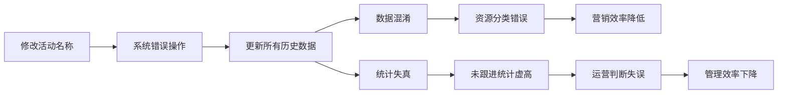

# SCRM回流数据问题分析报告

## 📋 文档概述
- **文档名称**: 副本关于回流数据问题梳理.docx
- **分析时间**: 2026-02-28
- **业务背景**: SCRM系统在回流（存量）资源处理中的问题分析

## 🎯 一、当前SCRM系统使用场景

### 1. 新增资源处理流程
```mermaid
graph TD
    A[SCRM系统创建活动] --> B[新增资源导入TMK公海]
    B --> C[电话外呼触达]
    C --> D[筛选及意向判断]
    D --> E{是否预约成功?}
    E -->|是| F[标记为"预约成功"]
    F --> G[自动流转回SCRM系统]
    G --> H[分配给对应销售/校区]
    H --> I[后续跟进转化]
    E -->|否| J[继续外呼或放弃]
```

### 2. 回流（存量）资源处理流程
```mermaid
graph TD
    A[广州分校存量资源] --> B[重新投入TMK团队]
    B --> C[清洗与激活]
    C --> D[在SCRM中创建/修改活动名称]
    D --> E[统一标签]
    E --> F[执行外呼触达]
    F --> G[筛选意向]
    G --> H{是否预约成功?}
    H -->|是| I[标记为"预约成功"]
    I --> J[流转回SCRM系统]
    J --> K[分配销售跟进]
    H -->|否| L[继续清洗或放弃]
```

## ⚠️ 二、回流资源中存在的BUG

### 问题描述
在回流存量资源场景下，对活动名称进行修改时，系统会将该活动下的**所有历史数据**一并更新名称，包括：
- 尚未回流的历史资源
- 已在读学员数据
- 已转化或无需跟进的资源

### 具体问题

#### 1. 数据混淆
- **现象**: 已转化或无需跟进的资源（未回流数据）会错误地归类在当前活动
- **影响**: 资源分类混乱，影响精准营销

#### 2. 看板统计失真
- **现象**: BI"未跟进资源提醒"会将所有历史数据（含已在读学员）计入未跟进统计
- **影响**: 
  - 干扰运营对真实需跟进资源的判断
  - 影响管理效率
  - 数据准确性受损

## 💡 三、核心诉求与解决方案

### 方案一：剔除干扰项（BI端优化）
- **目标**: BI"未跟进资源提醒及统计"中自动排除已在读学员数据
- **实现**: 仅统计真正需要外呼触达的资源
- **优势**: 快速见效，不影响现有业务流程

### 方案二：规范更名操作（系统端优化）
- **目标**: 更改活动名称时，仅对已回流的数据进行操作
- **实现**: 避免波及未回流及在读数据
- **优势**: 从源头减少统计干扰，治本之策

## 🔄 四、问题影响流程图



## 🛠️ 五、解决方案实施建议

### 短期方案（1-2周）
1. **BI报表优化**
   - 修改"未跟进资源提醒"统计逻辑
   - 排除已在读学员数据
   - 增加数据过滤条件

2. **操作规范培训**
   - 培训TMK团队规范操作
   - 建立操作检查清单

### 中期方案（1个月）
1. **系统功能优化**
   - 修改活动名称修改逻辑
   - 增加数据范围选择功能
   - 实现仅更新已回流数据

2. **数据隔离机制**
   - 建立回流数据与历史数据隔离
   - 增加数据状态标识

### 长期方案（3个月）
1. **系统架构优化**
   - 重构数据管理模块
   - 建立数据版本控制
   - 实现精细化权限管理

2. **智能分析系统**
   - 引入AI资源分类
   - 建立智能推荐系统
   - 实现自动化数据清洗

## 📊 六、关键指标与监控

### 需要监控的关键指标
1. **数据准确性**
   - 未跟进资源统计准确率
   - 资源分类准确率

2. **运营效率**
   - 销售跟进转化率
   - TMK外呼效率

3. **系统性能**
   - 数据处理速度
   - 系统稳定性

## 🎯 七、下一步行动建议

### 立即行动
1. ✅ 完成问题分析报告
2. 🔄 创建流程图（Excalidraw）
3. 📋 制定实施计划

### 短期行动
1. 与BI团队沟通报表优化方案
2. 与开发团队讨论系统修改方案
3. 制定培训计划

### 长期规划
1. 建立数据质量管理体系
2. 规划系统升级路线图
3. 建立持续优化机制

---

**分析人**: 皮休 (Pixiu)  
**分析时间**: 2026-02-28  
**文档状态**: 已完成分析，待创建流程图