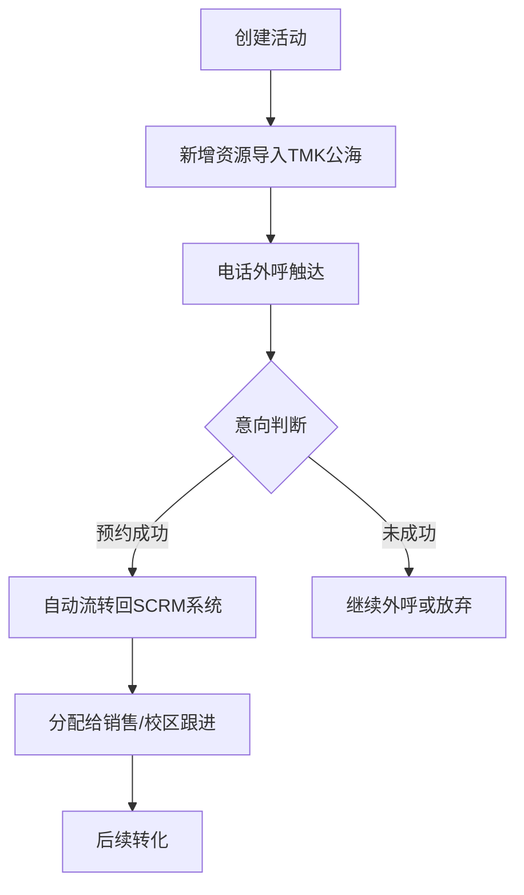
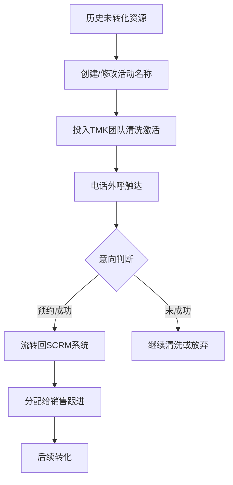
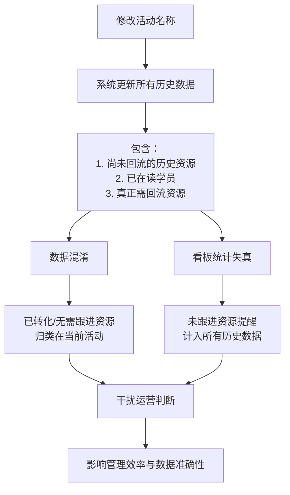
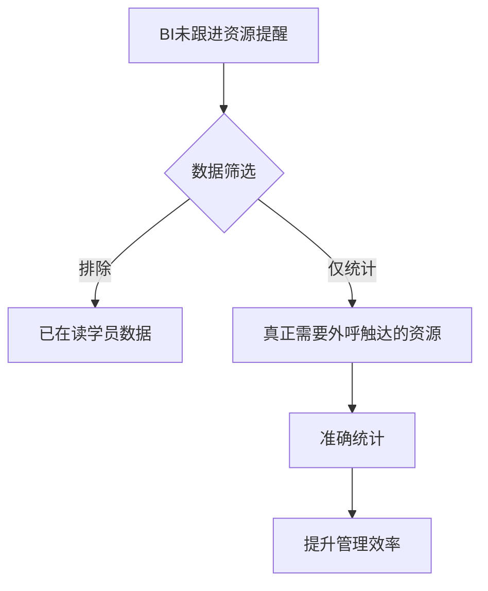
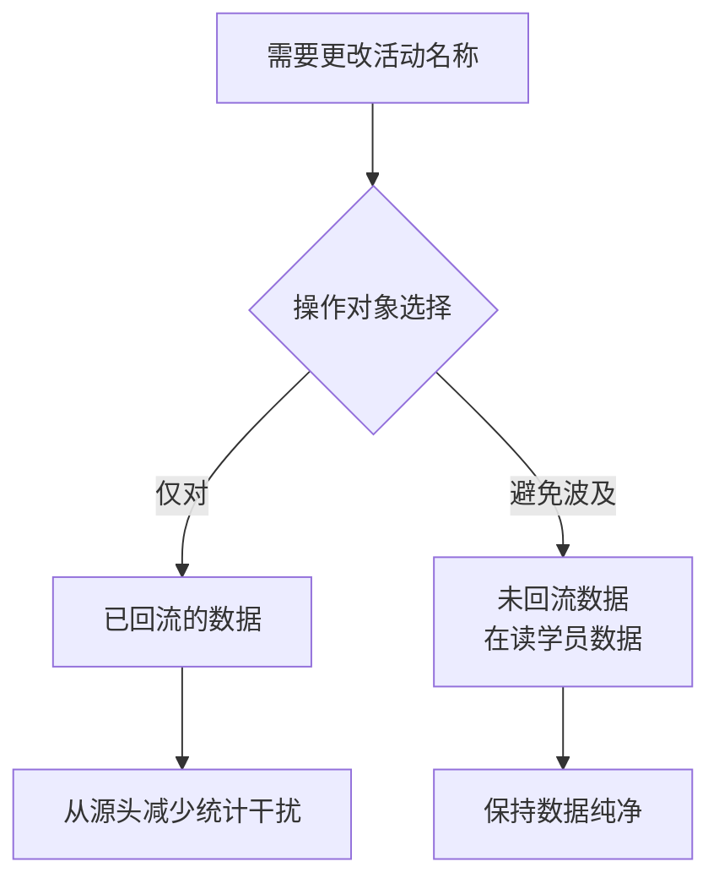
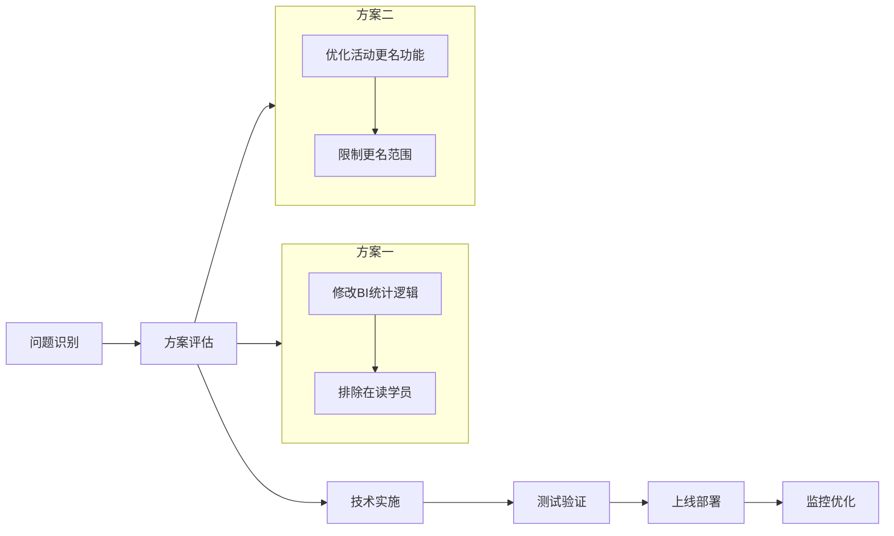

# 回流数据问题梳理 - 流程图分析

## 📊 文档概要
**文档标题**: 副本关于回流数据问题梳理.docx
**核心问题**: SCRM系统中回流（存量）资源处理流程的数据混淆和统计失真问题

## 🔄 系统使用场景

### 1. 新增资源处理流程

### 2. 回流（存量）资源处理流程

## ⚠️ 回流资源存在的BUG

### 问题流程图

## 🎯 核心诉求与解决方案

### 方案一：剔除干扰项

### 方案二：规范更名操作

## 📋 关键问题总结

### 数据混淆问题
1. **现象**: 修改活动名称时，系统更新所有历史数据
2. **影响**: 已转化/无需跟进资源被错误归类
3. **后果**: 数据准确性下降，运营判断受干扰

### 统计失真问题
1. **现象**: 未跟进资源提醒计入所有历史数据
2. **影响**: 包含已在读学员等不应统计的数据
3. **后果**: 管理效率降低，数据看板失真

## 💡 建议实施步骤

---
*分析完成时间: 2026-02-28*
*文档来源: 副本关于回流数据问题梳理.docx*
