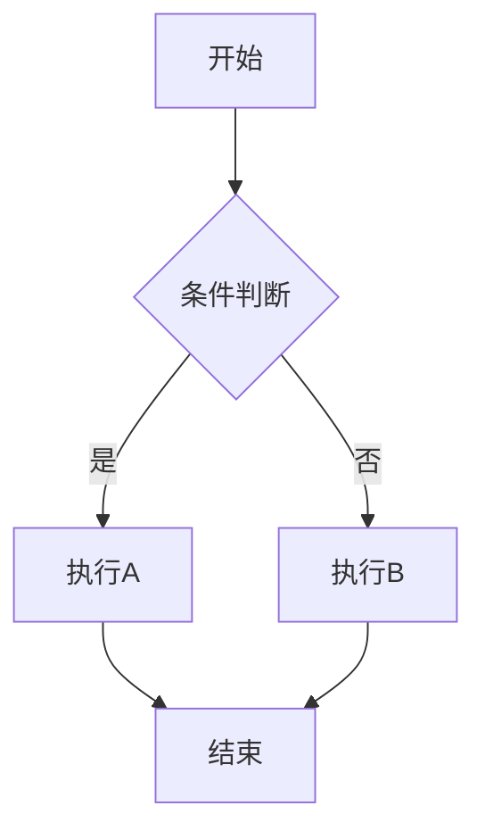
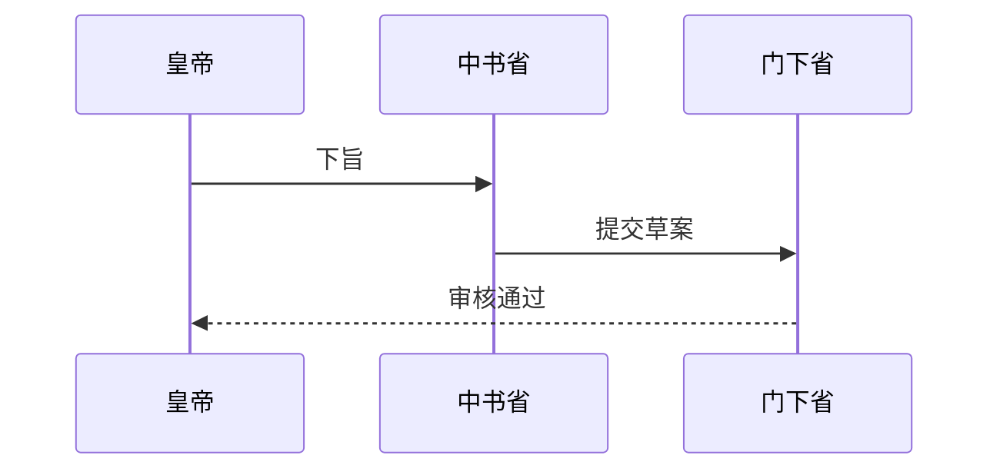

# 技能分享 - 小皮管家

## 技能名称

**Mermaid 流程图与 diagramming 语法**

---

## 技能特点

### 1. 纯文本编写，版本控制友好
Mermaid 使用纯文本语法编写图表，通过解析文本生成 SVG/PNG 图片。不需要安装任何图形软件，代码即图表。

```markdown
graph TD
    A[皇帝下旨] --> B{审核}
    B -->|通过| C[尚书省派发]
    B -->|驳回| D[打回修改]
```

**优点**：可以用 Git 管理，diff/merge 方便，适合团队协作。

### 2. 支持多种图表类型
| 类型 | 语法关键词 | 用途 |
|------|-----------|------|
| 流程图 | `graph TD/LR/BT` | 业务流程、决策树 |
| 时序图 | `sequenceDiagram` | API交互、用户操作序列 |
| 甘特图 | `gantt` | 项目计划、里程碑 |
| 饼图 | `pie` | 数据占比展示 |
| 状态图 | `stateDiagram` | 状态机、对象生命周期 |
| 实体关系图 | `erDiagram` | 数据库设计 |

### 3. 实时预览，工具链成熟
- **IDE 插件**：VS Code (Mermaid Preview)、IntelliJ IDEA
- **在线编辑器**：https://mermaid.live（免安装）
- **文档集成**：GitBook、Notion、飞书文档、Obsidian
- **PPT 集成**：Mermaid + reveal.js

---

## 应用场景

### 场景1：PRD/文档中的流程图
在飞书文档中插入 Mermaid 代码块，自动渲染业务流程图。

### 场景2：架构设计文档
展示微服务架构、数据流向、系统模块关系。

### 场景3：测试用例设计
用时序图展示 API 调用顺序，用流程图展示测试路径覆盖。

### 场景4：项目进度汇报
用甘特图展示 Sprint 计划、里程碑、依赖关系。

### 场景5：日常沟通
在 GitHub PR、Slack、飞书消息中嵌入 Mermaid 代码，用文字描述复杂流程。

---

## 学习资源

| 资源 | 链接 |
|------|------|
| 官方文档 | https://mermaid.js.org/ |
| 在线编辑器 | https://mermaid.live |
| VS Code 插件 | Mermaid Markdown Syntax Highlighting |
| 中文教程 | https://github.com/mermaid-js/mermaid/blob/develop/README-zhHans.md |

---

## 快速入门

```markdown
# 流程图示例


# 时序图示例


---

*学习人：小皮管家 | 2026-03-23 10:06*
